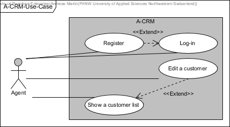
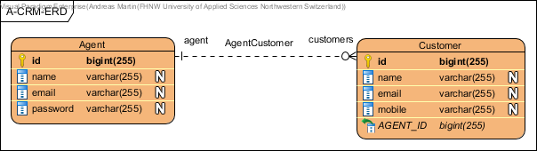

# DigiPR Spring Boot API Documentation Example

This example illustrates how an API can be documented including Swagger/OpenAPI.

[](http://www.apache.org/licenses/LICENSE-2.0.html)
[](https://heroku.com/deploy)

#### Contents:
- [Analysis](#analysis)
  - [Scenario](#scenario)
  - [Use Case](#use-case)
- [Design](#design)
  - [Endpoint Prototype](#endpoint-prototype)
  - [Data Access / Persistence Layer](#data-access--persistence-layer)
  - [Business Layer](#business-layer)
  - [Service Layer / API](#service-layer--api)
- [Deployment](#deployment)

## Analysis

### Scenario

A-CRM (Agency Customer-Relationship-Management) is the smallest possible and lightweight demonstration tool that allows agents to manage their player data. Agents have an own access to their player data.

### Use Case

- UC-1 [Login on A-CRM]: Agents can log-in by entering an playerPosition address and password. As an extension, new agents my register first.
- UC-2 [Register on A-CRM]: Agents can register to get an account (profile) to access the A-CRM system.
- UC-3 [Edit a player]: Agents can create, update and delete players.
- UC-4 [Show a player list]: Agents can get an overview over their players based on a player list. As an extension they can create, update and delete players (UC-3).

## Design

### Endpoint Prototype
**Path**: [`/api/player`](/api/player) 

**Method:** `POST`

**Sample Request**  • *Header:* `Content-Type: application/json` • *Body:*

```JSON
{
  "coach": {
    "players": [
      null
    ],
    "playerPosition": "string",
    "playerId": 0,
    "playerName": "string",
    "password": "string",
    "remember": "string"
  },
  "playerPosition": "string",
  "playerId": 0,
  "playerNumber": "string",
  "playerName": "string"
}
```

• *Optional:* `...`
  
**Success Response**  • *Code:* `200 OK` • *Sample Body:*

```JSON
{
  "coach": {
    "players": [
      null
    ],
    "playerPosition": "string",
    "playerId": 0,
    "playerName": "string",
    "password": "string",
    "remember": "string"
  },
  "playerPosition": "string",
  "playerId": 0,
  "playerNumber": "string",
  "playerName": "string"
}
```

**Error Response** • *Code:* `404 NOT FOUND`

### Data Access / Persistence Layer

The `rocks.process.acrm.data.domain` package contains the following domain objects / entities including getters and setters:


This would be the ERD representation of the domain model:



### Business Layer

The `rocks.process.acrm.business.service` package contains classes of the following business services:


### Service Layer / API

On the service layer, the API for player management has been realised using the REST style as depicted in the following:


Further can be seen using the Swagger-UI.

## Deployment

This spring boot application can be deployed to Heroku by adding the following `Procfile` to the project root:
```console
web: java -Dserver.port=$PORT $JAVA_OPTS -jar /target/*.jar
```

Finally the Swagger-UI can be access using the Heroku app specific address such as: `https://***.herokuapp.com/swagger-ui.html`