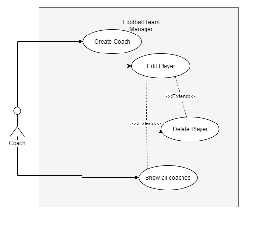
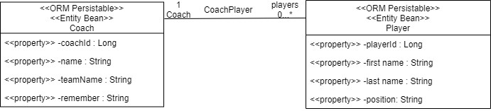

# Mugiwara

This example illustrates how an API can be documented including Swagger/OpenAPI.

[](http://www.apache.org/licenses/LICENSE-2.0.html)
[](https://heroku.com/deploy)

#### Contents:
- [Analysis](#analysis)
  - [Scenario](#scenario)
  - [Use Case](#use-case)
- [Design](#design)
  - [Endpoint Prototype](#endpoint-prototype)
  - [Data Access / Persistence Layer](#data-access--persistence-layer)
  - [Business Layer](#business-layer)
  - [Service Layer / API](#service-layer--api)
- [Deployment](#deployment)

## Analysis

### Scenario

A Football-Team-Manager is a small tool that allows coaches to manage their team. Coaches can change their team in e.g. by changing players.



### Use Case
- UC-1 [Login on A-CRM]: A User can create other Coaches and play with them
- UC-2 [Register on A-CRM]: Coach can create, edit, update and delete players.
- UC-3 [Edit a player]: Coaches can get an overview of all coaches.

## Design

### Endpoint Prototype
**Path**: [`/api/player`](/api/player) 

**Method:** `GET` getAllPlayers

**Sample Request**  • *Header:* `Content-Type: application/json` • *Body:*

```JSON
  {
    "playerId": 1,
    "playerFirstName": "Cristiano",
    "playerLastName": "Ronaldo",
    "playerPosition": "Striker"
  },
  {
    "playerId": 2,
    "playerFirstName": "Sergio",
    "playerLastName": "Ramos",
    "playerPosition": "Defender"
  },
  {
    "playerId": 3,
    "playerFirstName": "Luca",
    "playerLastName": "Modric",
    "playerPosition": "Middlefield"
  }
```

• *Optional:* `...`
  
**Success Response**  • *Code:* `200 OK` • *Sample Body:*

```JSON
{
  {
    "coach": {
      "coachId": 0,
      "coachName": "string",
      "players": [
        null
      ],
      "remember": "string",
      "teamName": "string"
    },
    "playerFirstName": "string",
    "playerId": 0,
    "playerLastName": "string",
    "playerPosition": "string"
  }
```

**Error Response** • *Code:* `404 NOT FOUND`

### Data Access / Persistence Layer

The `rocks.process.acrm.data.domain` package contains the following domain objects / entities including getters and setters:

This would be the ERD representation of the domain model:



### Business Layer

The `rocks.process.acrm.business.service` package contains classes of the following business services:


### Service Layer / API

On the service layer, the API for player management has been realised using the REST style as depicted in the following:


Further can be seen using the Swagger-UI.

## Deployment

This spring boot application can be deployed to Heroku by adding the following `Procfile` to the project root:
```console
web java -Dserver.port=$PORT $JAVA_OPTS -jar target/digipr-acrm-api-0.0.1-SNAPSHOT.jar
```

Finally the Swagger-UI can be access using the Heroku app specific address such as: `https://***.herokuapp.com/swagger-ui.html`
